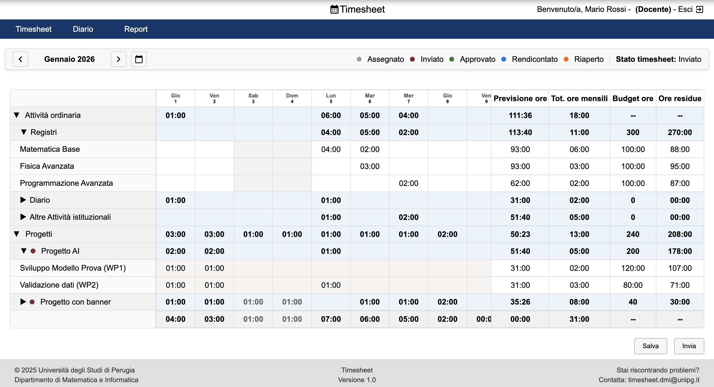
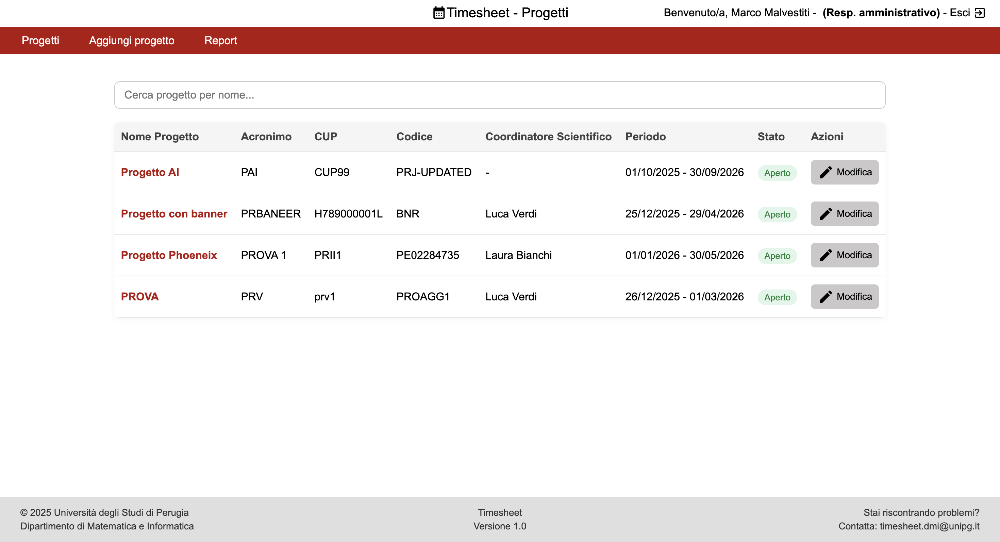
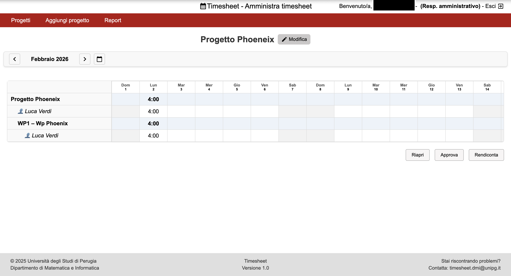
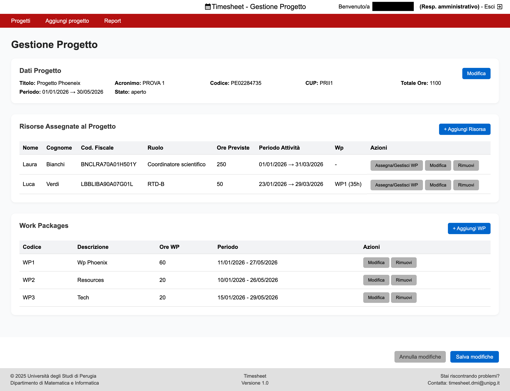
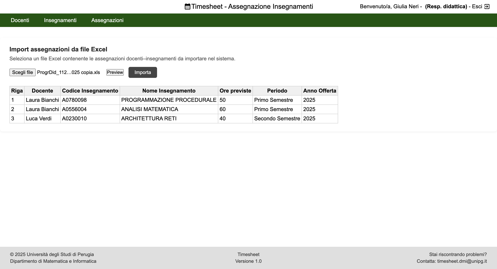

# University Teachers Timesheet Management System

A web application developed as part of my Bachelor's thesis in Computer Science at the University of Perugia.

The system centralizes the management and reporting of university teachers' activities, including teaching activities, institutional duties, and research project work packages.

## Features

- **Activity Management:** Manage teaching, institutional, and project-related activities.
- **Timesheet Management:** Organize and track working hours by month and academic year.
- **Project Reporting:** Record project activities and hours associated with specific work packages.
- **Role-Based Access Control:** Provide different functionalities according to user roles.
- **Reports and Excel Integration:** Support the reporting process through Excel templates.
- **Docker Deployment:** Run the application using a containerized environment.

## Technologies

- **Frontend:** HTML, CSS, JavaScript
- **Backend:** Node.js, Express
- **Database:** MariaDB / MySQL
- **Infrastructure:** Docker, Nginx

## Project Structure

- `html/` – Frontend pages, style, and JavaScript files.
- `node/` – Backend application, API routes, middleware, and database configuration.
- `nginx/` – Nginx reverse proxy configuration.
- `db/` – Database initialization files.
- `docker-compose.yaml` – Docker services configuration.

## Running the Project

The application is designed to run using Docker Compose.

1. Install Docker and Docker Compose.
2. Configure the environment variables using the provided `.env.example` files.
3. Initialize the MariaDB database using the supplied SQL dump.
4. Start the application with:

   ```bash
   docker compose up --build
   ```

Make sure the environment variables and database configuration are set correctly before starting the application.

## Screenshots

### Teacher's timesheet



### Projects





### Teaching



## Academic Context

Bachelor's thesis project – Computer Science, University of Perugia (Università degli Studi di Perugia).
